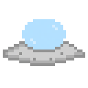

# Meteor Dodge

)

### DESCRIPCION

Meteor Dodge es un juego pequeño hecho en Python y la libreria Arcade.
Es sencillo, esquiva los meteoriotos y agarra a todos tus amigos aliens intenta durar lo mas que puedas!

### CONTROLES

W -> ARRIBA
S -> ABAJO
A -> IZQUIERDA
D -> DERECHA

#### INSTALACION

1. CLONA EL REPOSITORIO:

    comando : git clone https://github.com/tuusuario/meteor-dodge.git

2. ENTRA A LA CARPETA:

    comando: cd Meteor-Dodge

3. CREA UN ENTORNO VIRTUAL

    comando: python -m venv venv

4. ACTIVA EL ENTORNO VIRTUAL:

    Linux / Mac comando : source venv/bin/activate

    Windows comando : source venv/scripts/activate

5. INSTALA LAS DEPENDENICAS:

    comando: pip install -r requirements.txt

### POSIBLES FUTURAS ACTUALIZACIONES

1. USO DE LOS COLECCIONABLES:

    .Hacer una tienda de skin para que la cantidad de Aliens recogidos te permita comprar una skin

2. POWER UPS:

    .Poder agregar POWERUPS:

        .Hacerse mas pequeño
        .Aceleracion (Con posible agregado de medidor de distancia)

